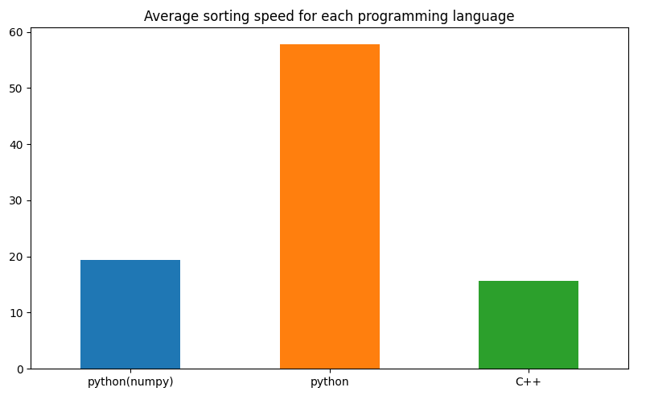

# Sorting Performance Analysis

## Overview

This project analyzes and compares the sorting performance of three approaches:

1. **Python's built-in sort function**
2. **NumPy's sorting function**
3. **A custom C++ sorting program**

The program generates a shuffled dataset of floating-point numbers, sorts the data using the three methods, and logs the execution time for each. The performance results are visualized as a bar chart.


## How the Project Works

### Workflow

1. **Data Generation:**

   - A Python script generates a file (`array.txt`) containing 10,000 floating-point numbers ranging from 0.01 to 99.99, shuffled randomly.

2. **Sorting:**

   - Python's built-in `sort` function sorts the data and logs the time in `stats_python.csv`.
   - NumPy's sorting function performs the sorting and logs the time in `stats_python.csv`.
   - A C++ program sorts the data and logs the time in `stats_cpp.txt`.

3. **Visualization:**

   - A Python script reads the statistics from `stats_python.csv` and `stats_cpp.txt` to generate a bar chart showing the average execution times for each method.

### Output

- Sorted numbers are written to separate output files (`sorted_python.txt`, `sorted_numpy.txt`, `sorted_cpp.txt`).
- Execution times are logged to:
  - `stats_python.csv`: Contains times for Python and NumPy sorting.
  - `stats_cpp.txt`: Contains times for the C++ sorting program.
- A performance comparison chart is generated using `charts.py`.

## How to Set Up and Run the Project

### Clone the Repository

```bash
git clone https://<your_access_token>@github.com/<your_username>/<your_repo>.git
cd <your_repo>
```

### Set Up the Environment

#### 1. Create a Virtual Environment

```bash
python -m venv venv
```

#### 2. Activate the Virtual Environment

- **Command Prompt:**
  ```bash
  .\venv\Scripts\activate
  ```
- **PowerShell:**
  ```bash
  .\venv\Scripts\Activate.ps1
  ```
- **Git Bash:**
  ```bash
  source venv/Scripts/activate
  ```

#### 3. Install Dependencies

```bash
pip install -r requirements.txt
```

### Run the Scripts

1. **Generate Data**

   ```bash
   python generate_array.py
   ```

   This creates the file `array.txt` with 10,000 shuffled numbers.

2. **Run Sorting Algorithms**

   ```bash
   python main.py
   ```

   This runs the Python and NumPy sorting scripts and executes the C++ program.

3. **Generate Reports**

   ```bash
   python charts.py
   ```

   This generates a bar chart (`chart.png`) comparing the average execution times.

## Dependencies

The project requires the following Python libraries:

- `numpy`
- `matplotlib`
- `pandas`

Ensure all dependencies are listed in `requirements.txt` for easy installation.

## Additional Notes

- Make sure a C++ compiler (e.g., `g++`) is installed and accessible in your system's PATH.
- The C++ program must be compiled before running it. You can modify the script to automate this process.
- Ensure that `array.txt` exists before running the sorting programs.

## Sample Results

As shown in the chart above, the performance comparison reveals:

- NumPy's sorting function is generally faster than Python's built-in sort.
- The C++ sorting implementation demonstrates the best performance, highlighting the efficiency of low-level programming languages for computational tasks.

